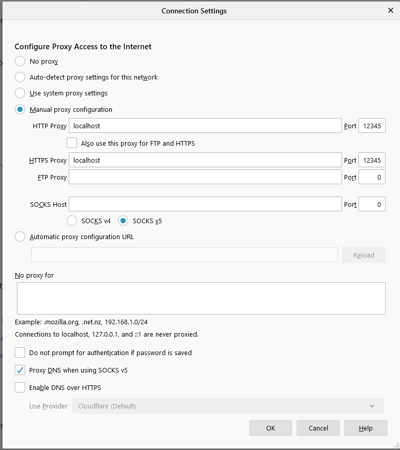

# http-proxy
An HTTP proxy written in python 3 that passes data between multiple web clients and servers. The proxy can handle HTTP requests and do HTTP CONNECT tunneling.
## Setup
This program is tested on Firefox. To configure Firefox, go to Connection Settings, select Manual proxy configuration, then set HTTP proxy and HTTPS proxy to localhost and set their coresponding ports to any desired valid port.    
This is what I have in my Connection Settings:     

## Run Script
A run script is provided. The script takes a port number as argument.      
For example, to run, type:     
./run 12345     
## notes
The code is tested on python 3.6.7 and 3.7.3
